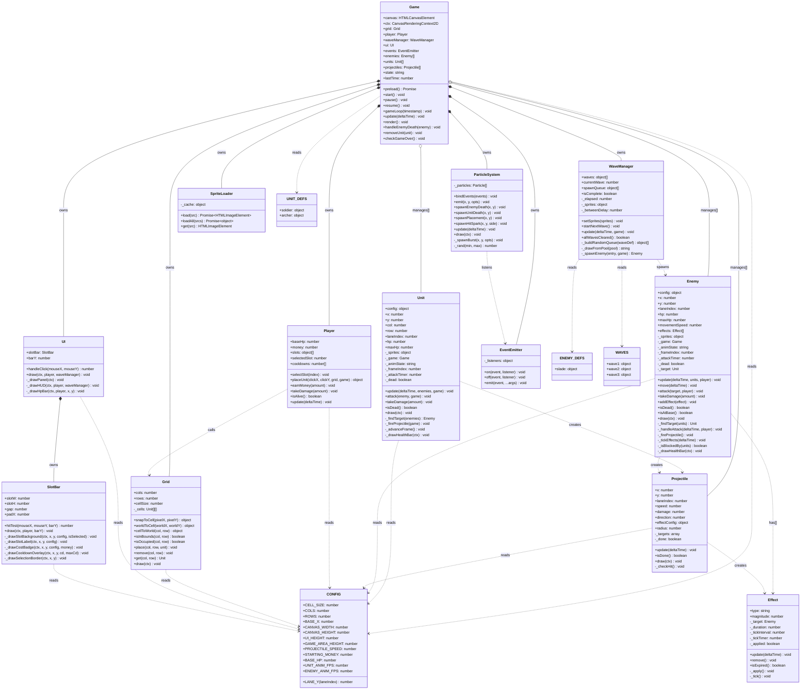

# 🌿 Garden Defense — Plants vs. Zombies-inspired Tower Defense

> A browser-based tower defense game built in **vanilla JavaScript** (ES6+) with HTML5 Canvas. Entities live in **continuous float world space** — the grid is a visual placement guide only. All unit/enemy type variation is **data-driven**: no subclassing needed.

---

## Table of Contents

1. [Project Overview](#project-overview)
2. [Team & Roles](#team--roles)
3. [Gameplay Specification](#gameplay-specification)
4. [Architecture & Class Design](#architecture--class-design)
5. [UML Class Diagram](#uml-class-diagram)
6. [Class Reference](#class-reference)
7. [Data Definitions](#data-definitions)
8. [Game Loop](#game-loop)
9. [Wave System](#wave-system)
10. [File Structure](#file-structure)
11. [Programming Guidelines](#programming-guidelines)
12. [Roadmap](#roadmap)

---

## Project Overview

**Garden Defense** is a PvZ-style tower defense game. The player places defensive **Units** (allies) on a grid to stop incoming **Enemies** from reaching the base. Enemies spawn from the right, travel leftward along horizontal lanes, and attack units blocking their path.

**Tech Stack:**

- JavaScript ES6+ (classes, modules)
- HTML5 Canvas (all rendering)
- No external libraries or frameworks — pure OOP

---

## Team & Roles

| Person | Role | Responsibilities |
|---|---|---|
| **Tomi** | Core Systems & Game Design | `Enemy` (logic), `Player`, `Unit` (logic), `Grid` (logic), `WaveManager`, `Effect`, data definitions (`unitDefs`, `enemyDefs`, `waves`), `CONFIG` |
| **Kevin** | AI-assisted Development & Advanced Features | `Game`, `Projectile` (logic), `EventEmitter`, `SpriteLoader`, `index.html`, `main.js` |
| **Marcell** | Art, Visual Code & Animation | `UI`, `SlotBar`, `ParticleSystem`, all `draw()` methods (`Unit`, `Enemy`, `Projectile`, `Grid`), all sprite sheets, background art |

> See [WORKFLOW.md](WORKFLOW.md) for detailed task breakdowns and [PLAN.md](PLAN.md) for upcoming features.

---

## Gameplay Specification

### Objective

Prevent enemies from crossing the board and reaching the base.  
- Base starts at **100 HP**.  
- Each enemy that reaches `x < CONFIG.BASE_X` deals damage and disappears.  
- **Win** when all waves are cleared and no enemies remain.  
- **Lose** when base HP drops to 0.

### The Board

The playing field is a **continuous 2D world** on an HTML5 Canvas (`800 × 560 px`).

```
World space (pixels)
  x →  0        80       160      ...     720      800
  y ↓  ┌────────┬────────┬────────┬───────┬────────┐
  0    │░BASE░░│        │  [U]   │       │        │  ← lane 0  (worldY =  40)
       │        │        │        │       │  👾──► │
  80   ├────────┼────────┼────────┼───────┼────────┤
       │░BASE░░│        │        │  [U]  │        │  ← lane 1  (worldY = 120)
  160  ├────────┼────────┼────────┼───────┼────────┤
       │░BASE░░│        │        │       │  👾──► │  ← lane 2  (worldY = 200)
  240  ├────────┼────────┼────────┼───────┼────────┤
       │░BASE░░│        │  [U]   │       │        │  ← lane 3  (worldY = 280)
  320  ├────────┼────────┼────────┼───────┼────────┤
       │░BASE░░│        │        │       │  👾──► │  ← lane 4  (worldY = 360)
  400  └────────┴────────┴────────┴───────┴────────┘
       ░ = base zone (x < 80)
       [U] = snapped unit (placed on grid center)
       👾 = enemy (moves continuously leftward)
       ─────────────────── UI Panel (160 px) ────────────
  560
```

**Key constants (`CONFIG.js`):**

| Constant | Value | Meaning |
|---|---|---|
| `CELL_SIZE` | 80 px | Width and height of one grid cell |
| `COLS` | 10 | Columns in the grid |
| `ROWS` | 5 | Rows (lanes) in the grid |
| `BASE_X` | 80 px | x boundary — enemy past this damages base |
| `CANVAS_WIDTH` | 800 px | Total canvas width |
| `CANVAS_HEIGHT` | 560 px | Total canvas height (game area + UI) |
| `GAME_AREA_HEIGHT` | 400 px | Playfield height (5 × 80) |
| `UI_HEIGHT` | 160 px | Bottom panel height |
| `STARTING_MONEY` | 150 | Starting money |
| `BASE_HP` | 100 | Starting base HP |
| `PROJECTILE_SPEED` | 400 px/s | Default projectile travel speed |
| `UNIT_ANIM_FPS` | 10 | Unit sprite animation framerate |
| `ENEMY_ANIM_FPS` | 10 | Enemy sprite animation framerate |

### Player Resources

| Resource | Start | Notes |
|---|---|---|
| Base HP | 100 | Reduced when an enemy passes `BASE_X` |
| Money | 150 | Spent on placing units; +5/s passive income |
| Slots | 6 | References to `UNIT_DEFS` entries |
| Cooldowns | 6 timers | One per slot; counts down in seconds |

### Controls

| Input | Action |
|---|---|
| Click a slot (bottom bar) | Select unit type |
| `1`–`6` keys | Select slot by number |
| Click the canvas (game area) | Place selected unit |
| `P` key | Pause / Resume |

### Combat Rules

- Units scan for the nearest enemy in the same lane within `config.range` pixels.
- Enemies scan for the nearest unit in the same lane within `config.range` pixels (physical body blocking applies at `CELL_SIZE * 0.55` px).
- `attackSpeed` = attacks per second; timer resets on each successful attack.
- `onAttack: 'melee'` → direct HP reduction on target.
- `onAttack: 'projectile'` → spawns a `Projectile` travelling in the appropriate direction.
- `effectOnHit` (optional) → when a projectile hits, an `Effect` is applied to the target.

---

## Architecture & Class Design

### Class Hierarchy

```
Game                     ← Main controller; owns all subsystems          [Kevin]
├── Grid                 ← 2D occupancy map + coordinate helpers         [Tomi / Marcell draw()]
├── Player               ← Base HP, money, slots, cooldowns              [Tomi]
├── WaveManager          ← Wave sequencing, timed spawn queue            [Tomi]
├── Unit[]               ← Ally units (data-driven, one concrete class)  [Tomi / Marcell draw()]
├── Enemy[]              ← Enemy units (data-driven, one concrete class) [Tomi / Marcell draw()]
├── Projectile[]         ← Travelling attack objects                     [Kevin / Marcell draw()]
├── Effect               ← Status conditions (applied to Enemy)         [Tomi]
├── ParticleSystem       ← Visual burst effects on events                [Marcell]
├── UI                   ← HUD rendering                                 [Marcell]
│   └── SlotBar          ← 6-slot selection bar                          [Marcell]
└── EventEmitter         ← Pub/sub event bus (decoupling)               [Kevin]

Utilities (no game logic):
├── CONFIG               ← All constants and derived helpers             [Tomi]
└── SpriteLoader         ← Async image cache                            [Kevin]
```

**No inheritance. No abstract classes.** `Unit` and `Enemy` are single concrete classes.  
All type variation is data — add entries to `UNIT_DEFS` / `ENEMY_DEFS`, no new JS files needed.

---

## UML Class Diagram



---

## Class Reference

### [`Game`](src/Game.js)

Main controller. Owns all subsystems, runs the game loop, handles input.

| Method | Description |
|---|---|
| `preload()` | Loads all sprite assets asynchronously |
| `start()` | Begins the game loop, starts first wave |
| `pause()` / `resume()` | Toggles game state |
| `gameLoop(ts)` | Called via `requestAnimationFrame`; computes `deltaTime`, calls `update` + `render` |
| `update(dt)` | Ticks player, waveManager, all enemies, units, projectiles; runs cleanup + game-over check |
| `render()` | Draws background → grid → units → enemies → projectiles → HUD |
| `handleEnemyDeath(e)` | Awards money if killed (not base-crossed); emits event |
| `removeUnit(u)` | Frees grid cell; emits event |
| `checkGameOver()` | Sets win/lose state and shows overlay |

---

### [`Grid`](src/Grid.js)

Logical occupancy map. Does **not** constrain movement — it only tracks which cells have units placed.

| Method | Description |
|---|---|
| `snapToCell(px, py)` | Returns `{ worldX, worldY, col, row }` — snapped to nearest cell center |
| `place(col, row, unit)` | Marks cell as occupied |
| `remove(col, row)` | Clears cell |
| `isOccupied(col, row)` | Returns `true` if a unit is present |
| `draw(ctx)` | Draws grid lines and base-zone highlight |

---

### [`Player`](src/Player.js)

Manages base HP, money, slot selection, and slot cooldowns.

| Method | Description |
|---|---|
| `selectSlot(i)` | Toggles selection on slot `i` |
| `placeUnit(x, y, grid, game)` | Validates cost/cooldown/occupancy; returns placement result or null |
| `takeDamage(n)` | Reduces `baseHp` (min 0) |
| `earnMoney(n)` | Increases `money` |
| `update(dt)` | Ticks down all cooldowns |

---

### [`Unit`](src/Unit.js)

Single concrete ally class. All type differences come from `config`.

| Method | Description |
|---|---|
| `update(dt, enemies, game)` | Finds target in lane, advances attack timer, fires when ready |
| `attack(enemy, game)` | Melee damage or spawns `Projectile` based on `config.onAttack` |
| `takeDamage(n)` | Reduces HP; sets `_dead` flag |
| `isDead()` | Returns `true` when HP ≤ 0 |
| `draw(ctx)` | Draws current animation frame + HP bar |

---

### [`Enemy`](src/Enemy.js)

Single concrete enemy class. All type differences come from `config`.

| Method | Description |
|---|---|
| `update(dt, units, player)` | Finds target, handles attack, moves, advances animation, checks base |
| `move(dt)` | Moves left at `movementSpeed` px/s (blocked by units ahead) |
| `attack(target, player)` | Melee damage or spawns `Projectile` leftward |
| `takeDamage(n)` | Reduces HP; sets `_dead` flag |
| `addEffect(effect)` | Pushes `Effect` onto `this.effects[]` |
| `isDead()` | Returns `true` when HP ≤ 0 |
| `isAtBase()` | Returns `true` when `x < CONFIG.BASE_X` |
| `draw(ctx)` | Draws current animation frame + HP bar |

---

### [`Projectile`](src/Projectile.js)

Travelling attack object. `direction = 1` → right (unit shot); `direction = -1` → left (enemy shot).

| Method | Description |
|---|---|
| `update(dt)` | Advances `x`; calls `_checkHit()`; marks done if off-screen |
| `_checkHit()` | Checks distance against all `_targets`; applies damage + optional `Effect` on hit |
| `isDone()` | Returns `true` when hit or out of bounds |
| `draw(ctx)` | Draws glowing circle (green for unit shots, orange for enemy shots) |

---

### [`Effect`](src/Effect.js)

Status condition applied to an `Enemy`. Multiple effects stack in `enemy.effects[]`.

| Property | Meaning |
|---|---|
| `type` | `'slow'` (more types planned: `burn`, `stun`, `weaken`) |
| `magnitude` | For `slow`: fraction of speed reduction (0.0–1.0) |
| `duration` | Remaining ms |
| `tickInterval` | ms between `_tick()` calls (0 = no ticking) |

| Method | Description |
|---|---|
| `update(dt)` | Counts down duration; fires `_tick()` if interval elapsed |
| `remove()` | Reverses applied stat changes (e.g. restores `movementSpeed`) |
| `isExpired()` | Returns `true` when `duration ≤ 0` |

---

### [`WaveManager`](src/WaveManager.js)

Controls wave sequencing and per-frame enemy spawning.

| Method | Description |
|---|---|
| `startNextWave()` | Builds spawn queue from next wave definition |
| `update(dt, game)` | Pops spawn entries on timer; transitions to next wave when field is clear |
| `allWavesCleared()` | Returns `true` when all waves done and queue empty |
| `_buildRandomQueue(waveDef)` | Randomly assigns enemy types (weighted) and lanes |
| `_spawnEnemy(entry, game)` | Creates `Enemy` instance and pushes to `game.enemies` |

---

### [`UI`](src/ui/UI.js) / [`SlotBar`](src/ui/SlotBar.js)

> **Owner: Marcell**

| Method | Description |
|---|---|
| `UI.draw(ctx, player, waveManager)` | Draws panel, HUD text, and slot bar |
| `UI.handleClick(mx, my)` | Returns slot index or `-1` |
| `SlotBar.draw(ctx, player, barY)` | Draws 6 slots with labels, cost badges, cooldown overlays |
| `SlotBar.hitTest(mx, my, barY)` | Returns slot index or `-1` |

---

### [`ParticleSystem`](src/ParticleSystem.js)

> **Owner: Marcell**

Manages a pool of short-lived `Particle` objects spawned on game events. Fully decoupled — subscribes to `EventEmitter` events and never touches game logic.

| Method | Description |
|---|---|
| `bindEvents(events)` | Subscribes to `enemyDied`, `unitDied`, `unitPlaced` on the game's `EventEmitter` |
| `spawnEnemyDeath(x, y)` | Red/orange explosion burst (18 particles) |
| `spawnUnitDeath(x, y)` | Green/teal puff burst (14 particles) |
| `spawnPlacement(x, y)` | Yellow sparkle on unit placement (10 particles) |
| `spawnHitSpark(x, y, side)` | Small hit-spark for projectile impacts |
| `emit(x, y, opts)` | Generic burst at any position with custom options |
| `update(dt)` | Advances all particles; removes expired ones |
| `draw(ctx)` | Renders all particles with glow + alpha fade |

Each `Particle` has: position, velocity, gravity, color, radius, lifetime. Radius shrinks and alpha fades as lifetime expires.

---

### [`EventEmitter`](src/utils/EventEmitter.js)

Minimal pub/sub bus — used to decouple systems (e.g. `Game` emits `enemyDied`; listeners can react without `Game` knowing about them).

---

### [`SpriteLoader`](src/utils/SpriteLoader.js)

Loads and caches `HTMLImageElement` objects by URL. `loadAll(srcs)` returns a `Promise<{src: img}>` map used by `Game.preload()`.

---

## Data Definitions

All entity variation lives in plain data objects. Zero new JS files are needed to add a new unit or enemy.

### Current Units (`src/data/unitDefs.js`)

| Key | Label | HP | Cost | Cooldown | Damage | Range | Attack |
|---|---|---|---|---|---|---|---|
| `soldier` | Soldier | 200 | $100 | 7.5 s | 40 | 85 px | Melee |
| `archer` | Archer | 100 | $125 | 8 s | 25 | 420 px | Projectile |

### Current Enemies (`src/data/enemyDefs.js`)

| Key | Label | HP | Speed | Damage | Range | Reward | Attack |
|---|---|---|---|---|---|---|---|
| `slade` | Slade | 120 | 50 px/s | 20 | 350 px | $25 | Projectile |

### Wave Structure (`src/data/waves.js`)

```js
{
  wave: 1,
  totalEnemies: 6,
  spawnInterval: 3000,   // ms between each enemy
  pool: [
    { defKey: 'slade', weight: 1 },
  ]
}
```

The `WaveManager` draws enemy types **randomly** (weighted) from the pool and assigns **random lanes** each run.

---

## Game Loop

```
requestAnimationFrame(timestamp)
        │
        ▼
  game.gameLoop(timestamp)
        │
        ├─ deltaTime = min((timestamp - lastTime) / 1000, 0.1)
        │
        ├─ game.update(deltaTime)
        │       ├── player.update()            → tick slot cooldowns
        │       ├── _tickPassiveIncome()        → +5 money/s
        │       ├── waveManager.update()        → spawn queued enemies
        │       ├── enemy.update() × N          → move + attack + effects
        │       ├── unit.update() × N           → find target + fire
        │       ├── projectile.update() × N     → travel + hit detection
        │       ├── _cleanup()                  → remove dead/done entities
        │       └── checkGameOver()
        │
        └─ game.render()
                ├── clear canvas
                ├── draw background (semi-transparent overlay)
                ├── grid.draw()
                ├── unit.draw() × N
                ├── enemy.draw() × N
                ├── projectile.draw() × N
                ├── ui.draw()                   → HP, money, wave, slots
                └── _drawPauseOverlay() if paused
```

---

## Wave System

| Wave | Enemies | Spawn Interval |
|---|---|---|
| 1 | 6× Slade | 3 000 ms |
| 2 | 10× Slade | 2 500 ms |
| 3 | 15× Slade | 2 000 ms |

Between waves: **5-second pause** before the next wave starts.  
Enemies spawn **one at a time** — the next enemy only enters when the field is clear.

**Planned waves (see [PLAN.md](PLAN.md)):** 10 total waves including melee enemies, tanky units, boss wave.

---

## File Structure

```
garden-defense/
├── index.html                  ← Page layout, CSS, canvas
├── README.md                   ← This file
├── PLAN.md                     ← Feature roadmap & asset checklist
├── WORKFLOW.md                 ← Team roles & development progress
├── assets/
│   ├── background.jpg
│   ├── htmlbackground.gif
│   ├── ally_Soldier_idle.png
│   ├── ally_Soldier_attack.png
│   ├── ally_Archer_idle.png
│   ├── ally_Archer_Shot.png
│   ├── enemy_Slade_moving.png
│   └── enemy_Slade_shooting.png
└── src/
    ├── main.js                 ← Entry point                          [Kevin]
    ├── Game.js                 ← Main controller & game loop          [Kevin]
    ├── Grid.js                 ← Occupancy map (logic: Tomi, draw: Marcell)
    ├── Player.js               ← HP, money, slots                    [Tomi]
    ├── Unit.js                 ← Ally class (logic: Tomi, draw: Marcell)
    ├── Enemy.js                ← Enemy class (logic: Tomi, draw: Marcell)
    ├── Projectile.js           ← Travelling attack (logic: Kevin, draw: Marcell)
    ├── Effect.js               ← Status conditions                   [Tomi]
    ├── WaveManager.js          ← Wave sequencing                     [Tomi]
    ├── ParticleSystem.js       ← Visual burst effects                [Marcell]
    ├── ui/
    │   ├── UI.js               ← HUD                                 [Marcell]
    │   └── SlotBar.js          ← Slot selection bar                  [Marcell]
    ├── data/
    │   ├── unitDefs.js         ← UNIT_DEFS (Soldier, Archer)         [Tomi]
    │   ├── enemyDefs.js        ← ENEMY_DEFS (Slade)                  [Tomi]
    │   └── waves.js            ← WAVES (3 waves)                     [Tomi]
    └── utils/
        ├── CONFIG.js           ← All constants                       [Tomi]
        ├── EventEmitter.js     ← Pub/sub bus                         [Kevin]
        └── SpriteLoader.js     ← Image cache                         [Kevin]
```

---

## Programming Guidelines

### Clean Code Rules

- **Naming:** Classes = `PascalCase`, methods/variables = `camelCase`, private = `_camelCase`, constants = `UPPER_SNAKE_CASE`
- **Functions:** One responsibility; max ~20 lines; extract if longer
- **No magic numbers:** All constants in `CONFIG.js`
- **Comments:** Explain *why*, not *what*
- **Immutability:** Prefer `const`; `let` only when a value must change
- **Error handling:** Validate at class boundaries

### OOP Rules

- **No inheritance** — `Unit` and `Enemy` are single concrete classes driven by `config` objects
- **New types = new data entries**, not new files
- **Effects are composable** — stack multiple `Effect` instances on any enemy
- **No global state** — everything lives on the `Game` instance
- **Events over direct calls** — use `EventEmitter` for cross-system signals

---

## Roadmap

| Phase | Goal | Status |
|---|---|---|
| 1 | Core grid, rendering, game loop | ✅ Done |
| 2 | Enemy movement, wave system | ✅ Done |
| 3 | Unit placement, combat, projectiles | ✅ Done |
| 4 | Effects system (`slow`) | ✅ Done |
| 5 | Full UI (HUD, slots, cooldowns) | ✅ Done |
| 6 | Sprite sheet animation | ✅ Done |
| 7 | More enemies (Grunt, ShieldBearer, Tank…) | 🔲 Planned |
| 8 | More units (Crossbowman, Mage, Knight…) | 🔲 Planned |
| 9 | Effects: `burn`, `stun`, `weaken` | 🔲 Planned |
| 10 | 10-wave campaign | 🔲 Planned |
| 11 | Sound & music | 🔲 Planned |
| 12 | Mobile touch support | 🔲 Planned |

> See [PLAN.md](PLAN.md) for detailed feature specs and [WORKFLOW.md](WORKFLOW.md) for team task assignments.

---

*Built with ❤️ by Tomi, Kevin & Marcell.*
